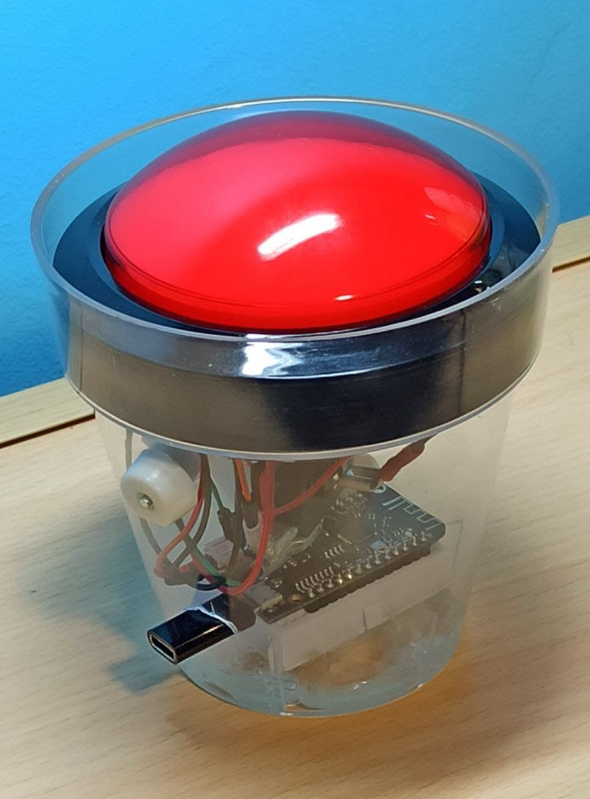

# Digital-Systems-Final-Project

This repository contains the source code of my Digital Systems project (2021).

## Project description
A big red button connected via bluetooth with a computer with a Python interface. Rechargable  lithium ion battery. USB Type-C conexion for accesible charging and a touch controlled deep-sleep wake up.
 

## Repository content
* [Source code](BigRedButton/BigRedButton.ino) of an esp32 micro controller used as a bluetooth button.
* [Python code](BigRedButton/BigRedButton.py) for linking the esp32 board with a computer.
* Some examples of use:
    *   [Test](BigRedButton/test_interface.py)
    *   [1 letter keyboard (space)](space_only_keyboard.py)
    *   [Privacy button](privacy_button.py)
* [C++ code](physics) with a simple physics engine as example of a button use.

## Run and compile
To compile and run this code (c++) it is needed [freeglut](http://freeglut.sourceforge.net/) libraries.

## Disclaimer
This repository is public because I like free and public code. It will not be maintain.

## Contact
In case of any doubts send email to unaileria@gmail.com.
